<!-- TOC -->

- [ceph组件介绍及基于ceph-deploy部署](#ceph组件介绍及基于ceph-deploy部署)
    - [一、基本架构](#一基本架构)
        - [1. 介绍](#1-介绍)
            - [1.1  软件定义存储 -SDS](#11--软件定义存储--sds)
            - [1.2 云存储](#12-云存储)
            - [1.3 下一代统一存储体系架构](#13-下一代统一存储体系架构)
    - [二、Ceph 架构](#二ceph-架构)
        - [2.1 Ceph组件](#21-ceph组件)
        - [2.1 Ceph部署架构](#21-ceph部署架构)
    - [三、ceph-deploy部署ceph集群](#三ceph-deploy部署ceph集群)
        - [3.1 修改各主机名称](#31-修改各主机名称)
        - [3.2 修改node1节点/etc/hosts文件，增加以下内容：](#32-修改node1节点etchosts文件增加以下内容)
        - [3.3 分别这三个节点上存储创建用户且赋予它root权限](#33-分别这三个节点上存储创建用户且赋予它root权限)
        - [3.4 在各节点上安装启用软件仓库，启用可选软件库](#34-在各节点上安装启用软件仓库启用可选软件库)
        - [3.5 配置允许无密码 SSH 登录](#35-配置允许无密码-ssh-登录)
        - [3.6 在管理节点node1 上修改~/.ssh/config文件(若没有则创建)增加一下内容：](#36-在管理节点node1-上修改sshconfig文件若没有则创建增加一下内容)
        - [3.7 在各节点上安装ntp（防止时钟偏移导致故障）、openssh](#37-在各节点上安装ntp防止时钟偏移导致故障openssh)
        - [3.8 在各节点上配置防火墙开放所需要的端口和selinux，更新系统](#38-在各节点上配置防火墙开放所需要的端口和selinux更新系统)
        - [3.9 在各节点上创建ceph 源（这里推荐使用网易或阿里的ceph源，若用官方源文件会很慢而且容易出现下载失败中断等问题，本人深受下载官方源的坑害）](#39-在各节点上创建ceph-源这里推荐使用网易或阿里的ceph源若用官方源文件会很慢而且容易出现下载失败中断等问题本人深受下载官方源的坑害)
        - [3.10 配置主机名解析，使用 /etc/hosts,或者dns](#310-配置主机名解析使用-etchosts或者dns)
        - [3.11  配置sudo不需要tty](#311--配置sudo不需要tty)
        - [3.12 ceph-deploy安装ceph集群](#312-ceph-deploy安装ceph集群)
            - [3.12.1 安装ceph-deploy(在node1节点操作)](#3121-安装ceph-deploy在node1节点操作)
            - [3.12.2 新建文件夹ceph-cluster(在node1节点操作)](#3122-新建文件夹ceph-cluster在node1节点操作)
            - [3.12.3 部署节点(在node1节点操作)](#3123-部署节点在node1节点操作)
            - [3.12.4 在my-cluster当前目录编辑ceph.conf配置文件(在node1节点操作)](#3124-在my-cluster当前目录编辑cephconf配置文件在node1节点操作)
            - [3.12.5 安装 ceph包，替代 ceph-deploy install node1 node2 ,不过下面的命令需要在每台node上安装](#3125-安装-ceph包替代-ceph-deploy-install-node1-node2-不过下面的命令需要在每台node上安装)
            - [3.12.6 配置初始 monitor(s)、并收集所有密钥：()](#3126-配置初始-monitors并收集所有密钥)
            - [3.12.7 把配置信息拷贝到各节点](#3127-把配置信息拷贝到各节点)
            - [3.12.8 配置 osd](#3128-配置-osd)
            - [3.12.9 部署 mgr ， L版以后才需要部署](#3129-部署-mgr--l版以后才需要部署)
    - [四、Ceph 块存储](#四ceph-块存储)
        - [4.1 安装 Ceph 块存储客户端](#41-安装-ceph-块存储客户端)
        - [4.2  Ceph块挂载](#42--ceph块挂载)
            - [4.2.1  创建 ceph 块客户端用户名和认证密钥](#421--创建-ceph-块客户端用户名和认证密钥)
            - [4.2.2 手工把密钥文件拷贝到客户端](#422-手工把密钥文件拷贝到客户端)
        - [4.2.3 客户端创建块设备及映射](#423-客户端创建块设备及映射)
        - [五、 Ceph 对象存储](#五-ceph-对象存储)
            - [5.1部署Ceph对象存储](#51部署ceph对象存储)
            - [5.2 部署RGW](#52-部署rgw)
            - [5.3 使用 S3 API 访问 Ceph 对象存储](#53-使用-s3-api-访问-ceph-对象存储)
    - [六、 Ceph 文件存储](#六-ceph-文件存储)
        - [6.1 部署 Ceph 文件存储](#61-部署-ceph-文件存储)
        - [6.2  部署 cephfs(node1)](#62--部署-cephfsnode1)
        - [6.3 创建用户(可选，因为部署时，已经生成)(node1)](#63-创建用户可选因为部署时已经生成node1)
        - [6.4 通过内核驱动和FUSE客户端挂载Ceph FS](#64-通过内核驱动和fuse客户端挂载ceph-fs)
        - [6.5 将Ceph FS 导出为NFS服务器](#65-将ceph-fs-导出为nfs服务器)

<!-- /TOC -->
# ceph组件介绍及基于ceph-deploy部署

## 一、基本架构
### 1. 介绍
在过去几年中，数据存储需求急剧增长。研究表明，大型组织中的数据正以每年40%到60%的速度增长，许多公司每年的数据都翻了一番。国际数据公司(IDC)的分析师估计，到2000年，全球共有54.4 exabytes 的数据。到2007年，这一数字达到295艾字节，到2020年，全球预计将达到44 zettabytes。传统的存储系统无法管理这样的数据增长;我们需要一个像Ceph这样的系统，它是分布式的，可扩展的，最重要的是，在经济上是可行的。Ceph是专门为处理当今和未来的数据存储需求而设计的。

```
1ZB=1024EB 1EB=1024PB 1PB=1024TB
```
#### 1.1  软件定义存储 -SDS
SDS是减少存储基础设施的TCO(总体成本)所需要的。除了降低存储成本外，SDS还可以提供灵活性、可伸缩性和可靠性。Ceph是一种真正的SDS;它运行在没有厂商锁定的普通硬件上。与传统的存储系统(硬件与软件结合在一起)不同，在SDS中，您可以从任何制造商中自由选择硬件，也可以根据自己的需要自由设计异构硬件解决方案。Ceph在此硬件之上的软件定义存储提供了您需要的所有，并将负责所有事情，从软件层提供了所有企业存储特性。
#### 1.2 云存储
目前已经和开源云架构OpenStack 结合起来，成为Openstack后端存储的标配，并且又同时支持用于kubernetes 动态
存储。
#### 1.3 下一代统一存储体系架构
<p>统一存储的定义最近发生了变化。几年前，术语“统一存储”指从单个系统提供文件和块存储。如今，由于近年来的技术进步，如云计算、大数据和物联网，一种新的存储方式正在进化，即对象存储。因此，所有不支持对象存储的存储系统都不是真正的统一存储解决方案。真正的统一存储就像Ceph;它支持来自单个系统的块、文件和对象存储。</p>
<p>Ceph是目前最热门的软件定义存储(SDS)技术，正在撼动整个存储行业。它是一个开源项目，为块、文件和对象存储提供统一的软件定义的解决方案。Ceph的核心思想是提供一个分布式存储系统，该系统具有大规模的可伸缩性和高性能，并且没有单点故障。从根本上说，它被设计成在通用硬件上运行时具有高度的可伸缩性(可达艾字节（ExaByte）级别甚
至更高)。</p>
<p>Ceph提供了出色的性能、巨大的可伸缩性、强大的功能和灵活性。它摆脱昂贵的专有存储。Ceph确实是一个企业级的存储解决方案，可以在普通硬件上运行;这是一个低成本但功能丰富的存储系统。Ceph的通用存储系统提供块存储、文件存储和对象存储，使客户可以随心所欲地使用存储。</p>
<p>Ceph 正在快速发展和改进，目前发布了十三个版本，每个长期版本都有一个名称,该名称遵循字母顺序发行。Ceph 的吉祥物是章鱼。</p>

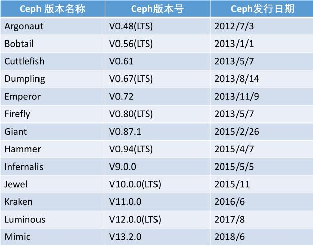

##  二、Ceph 架构
### 2.1 Ceph组件
- Ceph monitors(MON)：Ceph监视器通过保存集群状态的映射来跟踪整个集群的健康状况
- Ceph对象存储设备(OSD)： 一旦应用程序向Ceph集群发出写操作，数据就以对象的形式存储在OSD中。
    - 这是Ceph集群中存储实际用户数据的惟一组件，通常，一个OSD守护进程绑定到集群中的一个物理磁盘。因此，通常来说，Ceph集群中物理磁盘的总数与在每个物理磁盘上存储用户数据的OSD守护进程的总数相同。
- Ceph metadata server (MDS): MDS跟踪文件层次结构，仅为Ceph FS文件系统存储元数据
- RADOS: RADOS对象存储负责存储这些对象，而不管它们的数据类型如何。RADOS层确保数据始终保持一致。为此，它执行数据复制、故障检测和恢复，以及跨集群节点的数据迁移和再平衡。
- Librados: librados库是一种访问RADOS的方便方法，支持PHP、Ruby、Java、Python、C和c++编程语言。它为Ceph存储集群(RADOS)提供了本机接口，并为其他服务提供了基础，如RBD、RGW和CephFS，这些服务构建在librados之上。librados还支持从应用程序直接访问RADOS，没有HTTP开销。
- RBD：提供持久块存储，它是瘦配置的、可调整大小的，并在多个osd上存储数据条带。RBD服务被构建为一个在librados之上的本机接口。
- RGW：RGW提供对象存储服务。它使用librgw (Rados网关库)和librados，允许应用程序与Ceph对象存储建立连接。RGW提供了与Amazon S3和OpenStack Swift兼容的RESTful api接口。
- CephFS: Ceph文件系统提供了一个符合posix标准的文件系统，它使用Ceph存储集群在文件系统上存储用户数
据。与RBD和RGW一样，CephFS服务也作为librados的本机接口实现。
- Ceph manager: Ceph manager守护进程(Ceph -mgr)是在Kraken版本中引入的，它与monitor守护进程一起运行，
为外部监视和管理系统提供额外的监视和接口。

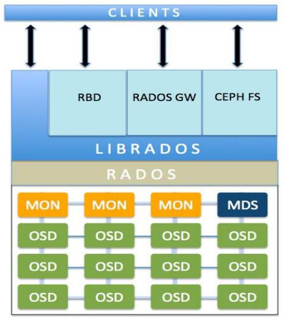
### 2.1 Ceph部署架构
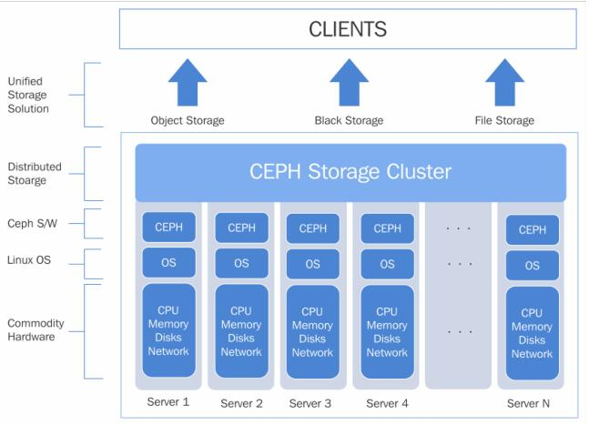


## 三、ceph-deploy部署ceph集群
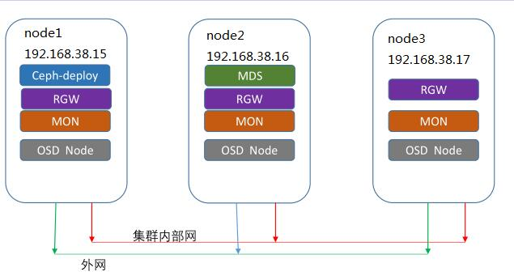
### 3.1 修改各主机名称
- 准备3台主机，并且分别修改各主机名（hostnamectl set-hostname xxx 后重启


```
IP地址            主机名（Hostname）
 
192.168.38.15                    node1 #（管理\监控\osd.0 节点）
192.168.38.16                    node2 #（管理\监控\osd.1 节点）
192.168.38.17                    node3 #（管理\监控\osd.2 节点）
```

### 3.2 修改node1节点/etc/hosts文件，增加以下内容：
```
192.168.1.24              node1
192.168.1.25              node2
192.168.1.26              node3
```

### 3.3 分别这三个节点上存储创建用户且赋予它root权限
```
useradd ${username}
echo "${passwd}" | passwd --stdin ${username}
echo "${username} ALL = (root) NOPASSWD:ALL" | sudo tee /etc/sudoers.d/${username}
chmod 0440 /etc/sudoers.d/${username}

----------------------------------------------------------------
# sudo useradd -d /home/liuzp  -m  liuzp
# sudo passwd liuzp 输入密码这里建议三台服务器密码设为一致）
//授予无密码sudo权限
#echo "liuzp ALL = (root) NOPASSWD:ALL" >> /etc/sudoers.d/liuzp
#sudo chmod 0440 /etc/sudoers.d/liuzp
----------------------------------------------------------------

```

### 3.4 在各节点上安装启用软件仓库，启用可选软件库
```
# sudo yum install -y yum-utils && sudo yum-config-manager --add-repo https://dl.fedoraproject.org/pub/epel/7/x86_64/ && sudo yum install --nogpgcheck -y epel-release && sudo rpm --import /etc/pki/rpm-gpg/RPM-GPG-KEY-EPEL-7 && sudo rm /etc/yum.repos.d/dl.fedoraproject.org*
 
# sudo yum install yum-plugin-priorities
```

### 3.5 配置允许无密码 SSH 登录
- 因为 ceph-deploy 不支持输入密码，你必须在管理节点上生成 SSH 密钥并把其公钥分发到各 Ceph 节点。 ceph-deploy 会尝试给初始 monitors 生成 SSH 密钥对。生成 SSH 密钥对，使用创建的用户不要用 sudo 或 root 。
- 生成密钥
```
# ssh-keygen（提示 “Enter passphrase” 时，直接回车，口令即为空如下）
----------------------------------------------------------------
Generating public/private key pair.
Enter file in which to save the key (/ceph-admin/.ssh/id_rsa):
Enter passphrase (empty for no passphrase):
Enter same passphrase again:
Your identification has been saved in /ceph-admin/.ssh/id_rsa.
Your public key has been saved in /ceph-admin/.ssh/id_rsa.pub.
```
- 把公钥拷贝到各 Ceph 节点上
```
#ssh-copy-id  liuzp@node1
#ssh-copy-id  liuzp@node2
#ssh-copy-id  liuzp@node3
```
### 3.6 在管理节点node1 上修改~/.ssh/config文件(若没有则创建)增加一下内容：
```
Host    node1
Hostname  192.168.38.15
User              liuzp
Host    node2
Hostname  192.168.38.15
User              liuzp
Host    node3
Hostname  192.168.38.15
User              liuzp
```
### 3.7 在各节点上安装ntp（防止时钟偏移导致故障）、openssh
```
#sudo yum install ntp ntpdate ntp-doc
#ntpdate cn.ntp.org.cn
#systemctl restart ntpd ntpdate && systemctl enable ntpd ntpdate
#sudo yum install openssh-server
```
1. 在192.168.38.15（node1节点）
> vim /etc/ntp.conf
- 注释如下四项：
```
#server 0.centos.pool.ntp.org iburst
#server 1.centos.pool.ntp.org iburst
#server 2.centos.pool.ntp.org iburst
#server 3.centos.pool.ntp.org iburst
```
>systemctl start ntpd.service<br>
>systemctl enable ntpd.service
2. 192.168.38.16(node2节点)、192.168.38.17（node3节点）执行
> vim /etc/ntp.conf
- 注释如下四项：
```
#server 0.centos.pool.ntp.org iburst
#server 1.centos.pool.ntp.org iburst
#server 2.centos.pool.ntp.org iburst
#server 3.centos.pool.ntp.org iburst
```
- 添加如下项：
```
server 192.168.38.15
```
>systemctl start ntpd.service<br>
>systemctl enable ntpd.service
- 注
> 如果安装后集群时间同步起不来，参考：
https://blog.csdn.net/c77_cn/article/details/45741831
### 3.8 在各节点上配置防火墙开放所需要的端口和selinux，更新系统
```
#firewall-cmd --zone=public --add-port=6789/tcp --permanent
#firewall-cmd --zone=public --add-port=6800-7100/tcp --permanent
#firewall-cmd --reload
#firewall-cmd --zone=public --list-all

//关闭selinux
sed -i "/^SELINUX/s/enforcing/disabled/" /etc/selinux/config
setenforce 0
```
### 3.9 在各节点上创建ceph 源（这里推荐使用网易或阿里的ceph源，若用官方源文件会很慢而且容易出现下载失败中断等问题，本人深受下载官方源的坑害）
- 在 /etc/yum.repos.d/目录下创建 ceph.repo然后写入以下内容
```
[ceph]
name=ceph
baseurl=http://mirrors.aliyun.com/ceph/rpm-luminous/el7/x86_64/
gpgcheck=0
priority=1

[ceph-noarch]
name=cephnoarch
baseurl=http://mirrors.aliyun.com/ceph/rpm-luminous/el7/noarch/
gpgcheck=0
priority=1

[ceph-source]
name=Ceph source packages
baseurl=http://mirrors.aliyun.com/ceph/rpm-luminous/el7/SRPMS
enabled=0
gpgcheck=1
type=rpm-md
gpgkey=http://mirrors.aliyun.com/ceph/keys/release.asc
priority=1
```
### 3.10 配置主机名解析，使用 /etc/hosts,或者dns
```
cat >>/etc/hosts<<EOF
$node1_ip $node1
$node2_ip $node2
$node3_ip $node3
EOF
```
### 3.11  配置sudo不需要tty
```
sed -i 's/Default requiretty/#Default requiretty/' /etc/sudoers
```

### 3.12 ceph-deploy安装ceph集群
#### 3.12.1 安装ceph-deploy(在node1节点操作)
```
sudo yum install -y ceph-deploy python-pip
```
#### 3.12.2 新建文件夹ceph-cluster(在node1节点操作)
```
mkdir my-cluster
cd my-cluster
```
#### 3.12.3 部署节点(在node1节点操作)
```
ceph-deploy new node1 node2 node3
```
#### 3.12.4 在my-cluster当前目录编辑ceph.conf配置文件(在node1节点操作)
- cat ceph.conf
```
[global]
.....
public network = 192.168.38.0/24
cluster network = 192.168.38.0/24
```
#### 3.12.5 安装 ceph包，替代 ceph-deploy install node1 node2 ,不过下面的命令需要在每台node上安装
```
yum install -y ceph ceph-radosgw
-----
# 本人在node1节点使用下面方法安装ceph
ceph-deploy install node1 node2 node3
```
#### 3.12.6 配置初始 monitor(s)、并收集所有密钥：()
```
ceph-deploy mon create-initial
ls -l *.keyring
```
#### 3.12.7 把配置信息拷贝到各节点
```
ceph-deploy admin node1 node2 node3
```
#### 3.12.8 配置 osd
```
for dev in /dev/sdb /dev/sdc /dev/sdd
do
  ceph-deploy disk zap node1 $dev
  ceph-deploy osd create node1 --data $dev
  ceph-deploy disk zap node2 $dev
  ceph-deploy osd create node2 --data $dev
  ceph-deploy disk zap node3 $dev
  ceph-deploy osd create node3 --data $dev
done
```
#### 3.12.9 部署 mgr ， L版以后才需要部署
```
ceph-deploy mgr create node1 node2 node3
```
- 开启 dashboard 模块，用于UI查看
```
ceph mgr module enable dashboard
```
- 访问页面
```
curl http://192.168.38.15:7000
```
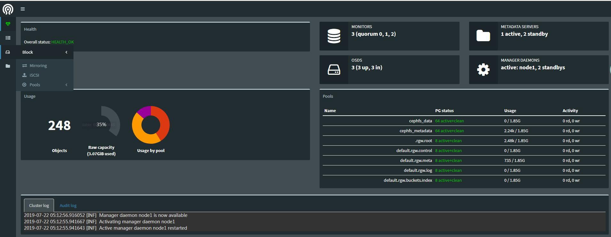
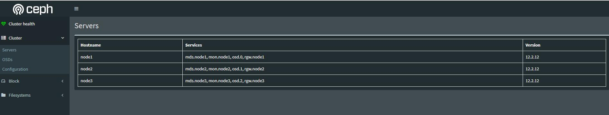


## 四、Ceph 块存储

### 4.1 安装 Ceph 块存储客户端
Ceph块设备，以前称为RADOS块设备，为客户机提供可靠的、分布式的和高性能的块存储磁盘。RADOS块设备利用librbd库并以顺序的形式在Ceph集群中的多个osd上存储数据块。RBD是由Ceph的RADOS层支持的，因此每个块设备都分布在多个Ceph节点上，提供了高性能和优异的可靠性。RBD有Linux内核的本地支持，这意味着RBD驱动程序从过去几年就与Linux内核集成得很好。除了可靠性和性能之外，RBD还提供了企业特性，例如完整和增量快照、瘦配置、写时复制克隆、动态调整大小等等。RBD还支持内存缓存，这大大提高了其性能:

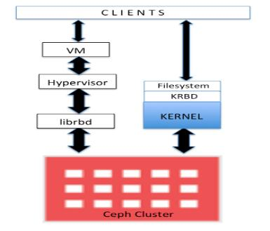

任何普通的Linux主机(RHEL或基于debian的)都可以充当Ceph客户机。客户端通过网络与Ceph存储集群交互以存储或检索用户数据。Ceph RBD支持已经添加到Linux主线内核中，从2.6.34和以后的版本开始。

### 4.2  Ceph块挂载
- 下面把Ceph集群（node1、node2、node3）的OSD以块形式挂载到node4(192.168.38.18)节点

#### 4.2.1  创建 ceph 块客户端用户名和认证密钥
- 挂载ceph块需要密钥
- 下面是管理员密钥，一般块挂载尽量不要使用管理员密钥
```
# cat /etc/ceph/ceph.client.admin.keyring
[client.admin]
        key = AQBNRjFdNcr2CRAAYiiWwH9ESG0HXw9iIe8ZaA==
```
- 创建普通用户密钥
  - 对存储池rbd进行mon授权（rbd是默认存储池）
```
ceph auth get-or-create client.rbd mon 'allow r' osd 'allow class-read object_prefix rbd_children, allow rwx pool=rbd' |tee ./ceph.client.rbd.keyring
注：tee ./ceph.client.rbd.keyring 把授权密钥放在本地指定文件中
```

#### 4.2.2 手工把密钥文件拷贝到客户端
- 在node4节点（192.168.38.18）上创建/etc/ceph
```
mkdir /etc/ceph -p
```
- node1 节点拷贝ceph.client.rbd.keyring到node4
```
 scp ceph.client.rbd.keyring node4:/etc/ceph/
```
- node4节点安装客户端
  - 在 /etc/yum.repos.d/目录下创建 ceph.repo然后写入以下内容
```
vim /etc/yum.repos.d/ceph.repo
```
```
[ceph]
name=ceph
baseurl=http://mirrors.aliyun.com/ceph/rpm-luminous/el7/x86_64/
gpgcheck=0
priority=1

[ceph-noarch]
name=cephnoarch
baseurl=http://mirrors.aliyun.com/ceph/rpm-luminous/el7/noarch/
gpgcheck=0
priority=1

[ceph-source]
name=Ceph source packages
baseurl=http://mirrors.aliyun.com/ceph/rpm-luminous/el7/SRPMS
enabled=0
gpgcheck=1
type=rpm-md
gpgkey=http://mirrors.aliyun.com/ceph/keys/release.asc
priority=1
```
 - 安装ceph
  - 在各节点上安装启用软件仓库，启用可选软件库
  ```
  # sudo yum install -y yum-utils && sudo yum-config-manager --add-repo https://dl.fedoraproject.org/pub/epel/7/x86_64/ && sudo yum install --nogpgcheck -y epel-release && sudo rpm --import /etc/pki/rpm-gpg/RPM-GPG-KEY-EPEL-7 && sudo rm /etc/yum.repos.d/dl.fedoraproject.org*
  
  # sudo yum install yum-plugin-priorities
  ```
  - install ceph

  ```
  yum -y install ceph
  # 把node1的ceph.conf文件拷贝到node4节点
  scp /etc/ceph/ceph.conf node4:/etc/ceph/

  cat /etc/ceph/ceph.client.rbd.keyring
  ceph -s --name client.rbd
  # 在node4执行ceph -s 会使用管理员权限，故会报错，请使用客户端权限连接ceph -s --name client.rbd
  ```
### 4.2.3 客户端创建块设备及映射
1. 创建块设备
- 默认创建块设备，会直接创建在rbd 池中，但使用 deploy 安装后，该rbd池并没有创建。
- 在node1节点创建池和块
```
ceph osd lspools # 查看集群存储池
ceph osd pool create rbd 50 # 50 为 place group 数量，由于我们后续测试，也需要更多的pg,所以这里设置为50
```
  - 注：确定 pg_num 取值是强制性的，因为不能自动计算。下面是几个常用的值：
    - 少于 5 个 OSD 时可把 pg_num 设置为 128
    - OSD 数量在 5 到 10 个时，可把pg_num 设置为 512
    - OSD 数量在 10 到 50 个时，可把 pg_num 设置为 4096
    - OSD 数量大于 50 时，你得理解权衡方法、以及如何自己计算pg_num 取值
2. 客户端创建 块设备
```
rbd create rbd2 --size 1024 --name client.rbd
# --size 1024单位为MB
```
- 查看块信息
```
rbd ls --name client.rbd
rbd ls -p rbd --name client.rbd
rbd list --name client.rbd
rbd --image rbd2 info --name client.rbd
---------------------
rbd image 'rbd2':
        size 1GiB in 256 objects
        order 22 (4MiB objects)
        block_name_prefix: rbd_data.3e0e36b8b4567
        format: 2
        features: layering, exclusive-lock, object-map, fast-diff, deep-flatten
        flags:
        create_timestamp: Mon Jul 22 22:17:42 2019

```
3. 映射块设备
- 映射到客户端，应该会报错
```
rbd map --image rbd1 --name client.rbd
-----------------------
rbd: sysfs write failed
RBD image feature set mismatch. You can disable features unsupported by the kernel with "rbd feature disable rbd2 object-map fast-diff".
In some cases useful info is found in syslog - try "dmesg | tail".
rbd: map failed: (6) No such device or address

```
  - layering: 分层支持
  - exclusive-lock: 排它锁定支持对
  - object-map: 对象映射支持(需要排它锁定(exclusive-lock))
  - deep-flatten: 快照平支持(snapshot flatten support)
  - fast-diff: 在client-node1上使用krbd(内核rbd)客户机进行快速diff计算(需要对象映射)，我们将无法在CentOS内核3.10上映射块设备映像，因为该内核不支持对象映射(object-map)、深平(deep-flatten)和快速diff(fast-diff)(在内核4.9中引入了支持)。为了解决这个问题，我们将禁用不支持的特性，有几个选项可以做到这一点:
    - 1）动态禁用
    ```
    rbd feature disable rbd2 exclusive-lock object-map deep-flatten fast-diff --name client.rbd
    ``` 
    - 2） 创建RBD镜像时，只启用 分层特性。
    ```
    rbd create rbd2 --size 1024 --image-feature layering --name client.rbd
    ```
    - 3）ceph 配置文件中禁用
    ```
    rbd_default_features = 1
    ```
-  我们这里动态禁用
```
rbd feature disable rbd2 exclusive-lock object-map deep-flatten fast-diff --name client.rbd
rbd map --image rbd2 --name client.rbd
----
/dev/rbd0

rbd showmapped --name client.rbd
----
id pool image snap device
0  rbd  rbd2  -    /dev/rbd0
```
-  创建文件系统，并挂载
```
fdisk -l /dev/rbd0
mkfs.xfs /dev/rbd0
mkdir /mnt/ceph-disk1
mount /dev/rbd0 /mnt/ceph-disk1

df -h /mnt/ceph-disk1
---
Filesystem      Size  Used Avail Use% Mounted on
/dev/rbd0      1014M   33M  982M   4% /mnt/ceph-disk1
```
- 写入数据测试
```
[root@node4 ceph]# dd if=/dev/zero of=/mnt/ceph-disk1/file1 count=100 bs=1M
100+0 records in
100+0 records out
104857600 bytes (105 MB) copied, 0.0887969 s, 1.2 GB/s
---------------
[root@node4 ceph]# df -h /mnt/ceph-disk1
Filesystem      Size  Used Avail Use% Mounted on
/dev/rbd0      1014M  133M  882M  14% /mnt/ceph-disk1
--------------
[root@node4 ceph]# ll /mnt/ceph-disk1/
total 102400
-rw-r--r--. 1 root root 104857600 Jul 22 22:32 file1
--------------
[root@node4 ceph]# ll -h /mnt/ceph-disk1/
total 100M
-rw-r--r--. 1 root root 100M Jul 22 22:32 file1
```

- 做成服务，开机自动挂载
  - vim /usr/local/bin/rbd-mount
  ```
  #!/bin/bash

  # Pool name where block device image is stored
  export poolname=rbd

  # Disk image name
  export rbdimage=rbd2

  # Mounted Directory
  export mountpoint=/mnt/ceph-disk1

  # Image mount/unmount and pool are passed from the systemd service as arguments
  # Are we are mounting or unmounting
  if [ "$1" == "m" ]; then
    modprobe rbd
    rbd feature disable $rbdimage object-map fast-diff deep-flatten
    rbd map $rbdimage --id rbd --keyring /etc/ceph/ceph.client.rbd.keyring
    mkdir -p $mountpoint
    mount /dev/rbd/$poolname/$rbdimage $mountpoint
  fi
  if [ "$1" == "u" ]; then
    umount $mountpoint
    rbd unmap /dev/rbd/$poolname/$rbdimage
  fi
  ```
  - /usr/local/bin/rbd-mount添加执行权限
  ```
  chmod +x /usr/local/bin/rbd-mount
  ```
  - /etc/systemd/system/rbd-mount.service
  ```
  [Unit]
  Description=RADOS block device mapping for $rbdimage in pool $poolname"
  Conflicts=shutdown.target
  Wants=network-online.target
  After=NetworkManager-wait-online.service
  [Service]
  Type=oneshot
  RemainAfterExit=yes
  ExecStart=/usr/local/bin/rbd-mount m
  ExecStop=/usr/local/bin/rbd-mount u
  [Install]
  WantedBy=multi-user.target
  ```
  - 设置开机重启
  ```
  systemctl daemon-reload
  systemctl enable rbd-mount.service
  reboot -f
  df -h
  ```
  - 卸载挂载
  ```
  [root@node4 ceph]# umount /mnt/ceph-disk1/
  [root@node4 ceph]# ll -h /mnt/ceph-disk1/
  total 0
  ```
### 五、 Ceph 对象存储
#### 5.1部署Ceph对象存储
<p>作为文件系统的磁盘，操作系统不能直接访问对象存储。相反，它只能通过应用程序级别的API访问。Ceph是一种分布式对象存储系统，通过Ceph对象网关提供对象存储接口，也称为RADOS网关(RGW)接口，它构建在Ceph RADOS层之
上。RGW使用librgw (RADOS Gateway Library)和librados，允许应用程序与Ceph对象存储建立连接。RGW为应用程序提供了一个RESTful S3 / swift兼容的API接口，用于在Ceph集群中以对象的形式存储数据。Ceph还支持多租户对象存储，可以通过RESTful API访问。此外，RGW还支持Ceph管理API，可以使用本机API调用来管理Ceph存储集群。</p>
<p>librados软件库非常灵活，允许用户应用程序通过C、c++、Java、Python和PHP绑定直接访问Ceph存储集群。Ceph对象存储还具有多站点功能，即为灾难恢复提供解决方案</p>

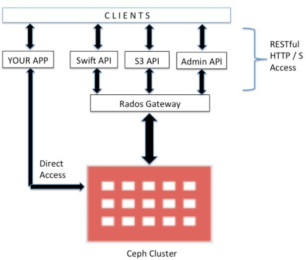
<p>对于生产环境，建议您在物理专用机器上配置RGW。但是，如果您的对象存储工作负载不太大，您可以考虑将任何监视器机器作为RGW节点使用。RGW是一个独立的服务，它从外部连接到Ceph集群，并向客户端提供对象存储访问。在生产环境中，建议您运行多个RGW实例，由负载均衡器屏蔽，如下图所示:</p>

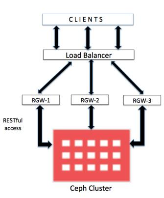

#### 5.2 部署RGW
1. 安装ceph-radosgw
```
yum -y install ceph-radosgw
```
2. 部署
```
ceph-deploy rgw create node1 node2 node3
```
3. 默认端口7480，可以通过配置修改端口
```
vi /etc/ceph/ceph.conf
…….
[client.rgw.node1]
rgw_frontends = "civetweb port=80"
```
```
sudo systemctl restart ceph-radosgw@rgw.node1.service
```
4. 创建OSD池
- 在my-cluster目录下创建pool和create_pool.sh 
  - vim pool
  ```
  .rgw
  .rgw.root
  .rgw.control
  .rgw.gc
  .rgw.buckets
  .rgw.buckets.index
  .rgw.buckets.extra
  .log
  .intent-log
  .usage
  .users
  .users.email
  .users.swift
  .users.uid
  ```
  - vim create_pool.sh
  ```
  #!/bin/bash

  PG_NUM=250
  PGP_NUM=250
  SIZE=3

  for i in `cat ./pool`
          do
          ceph osd pool create $i $PG_NUM
          ceph osd pool set $i size $SIZE
          done

  for i in `cat ./pool`
          do
          ceph osd pool set $i pgp_num $PGP_NUM
          done
  ```
- 删除rdb池
```
ceph osd pool delete rbd rbd --yes-i-really-really-mean-it
```
  - 脚本vim delete_poo.sh
  ```
  #!/bin/bash

  PG_NUM=250
  PGP_NUM=250
  SIZE=3

  for i in `cat ./pool`
          do
          ceph osd pool delete $i $i --yes-i-really-really-mean-it
          done

  ```
- 测试是否能够访问ceph 集群
  ```
  ceph -s -k /var/lib/ceph/radosgw/ceph-rgw.node1/keyring --name client.rgw.node1
  ```
  - 文件keyring是ceph权限，本账户没有该操作权限需要拷贝出来
  ```
  cp /var/lib/ceph/radosgw/ceph-rgw.node1/keyring .
  ceph -s -k keyring --name client.rgw.node1
  ```
#### 5.3 使用 S3 API 访问 Ceph 对象存储
1. 创建 radosgw 用户
```
radosgw-admin user create --uid=radosgw --display-name=“radosgw"
```
-注意：请把 access_key 和 secret_key 保存下来 ，如果忘记可使用：
```
radosgw-admin user info --uid … -k … --name …
```
2. 安装 s3cmd 客户端
```
yum install s3cmd -y
```
3. 将会在家目录下创建 .s3cfg 文件 , location 必须使用 US , 不使用 https,
```
s3cmd --configure
```
4.  编辑 .s3cfg 文件，修改 host_base 和 host_bucket
```
……
host_base = node1:7480
host_bucket = %(bucket).node1:7480
……
# 创建桶并放入文件
s3cmd mb s3://first-bucket
s3cmd ls
s3cmd put /etc/hosts s3://first-bucket
s3cmd ls s3://first-bucket
```
5. 其它端连接请参考下面链接对应的博客
- https://www.cnblogs.com/bugutian/p/9817347.html

## 六、 Ceph 文件存储
### 6.1 部署 Ceph 文件存储
Ceph文件系统提供了任何大小的符合posix标准的分布式文件系统，它使用Ceph RADOS存储数据。要实现Ceph文件系统，您需要一个正在运行的Ceph存储集群和至少一个Ceph元数据服务器(MDS)来管理其元数据并使其与数据分离，这有助于降低复杂性和提高可靠性。下图描述了Ceph FS的架构视图及其接口:
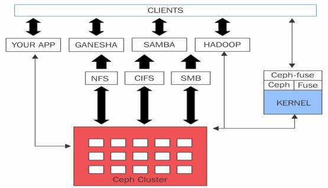
libcephfs库在支持其多个客户机实现方面发挥着重要作用。它具有本机Linux内核驱动程序支持，因此客户机可以使用本机文件系统安装，例如，使用mount命令。它与SAMBA紧密集成，支持CIFS和SMB。Ceph FS使用cephfuse模块扩展到用户空间(FUSE)中的文件系统。它还允许使用libcephfs库与RADOS集群进行直接的应用程序交互。作为HadoopHDFS的替代品，Ceph FS越来越受欢迎。
<p>只有Ceph FS才需要Ceph MDS;其他存储方法的块和基于对象的存储不需要MDS服务。Ceph MDS作为一个守护进程运行，它允许客户机挂载任意大小的POSIX文件系统。MDS不直接向客户端提供任何数据;数据服务仅由OSD完成。</p>

### 6.2  部署 cephfs(node1)
```
ceph-deploy mds create node2
# 注意：查看输出，应该能看到执行了哪些命令，以及生成的keyring
```
```
ceph osd pool create cephfs_data 128
ceph osd pool create cephfs_metadata 64
ceph fs new cephfs cephfs_metadata cephfs_data
ceph mds stat
ceph osd pool ls
ceph fs ls
```
### 6.3 创建用户(可选，因为部署时，已经生成)(node1)
```
ceph auth get-or-create client.cephfs mon 'allow r' mds 'allow r, allow rw path=/' osd 'allow rw pool=cephfs_data' -o ceph.client.cephfs.keyring
scp ceph.client.cephfs.keyring node4:/etc/ceph/
```
### 6.4 通过内核驱动和FUSE客户端挂载Ceph FS
- 在Linux内核2.6.34和以后的版本中添加了对Ceph的本机支持。
1. 创建挂载目录
```
mkdir /mnt/cephfs
```
2. 挂载
```
ceph auth get-key client.cephfs // 在 ceph fs服务器上执行，获取key
mount -t ceph node2:6789:/ /mnt/cephfs -o name=cephfs,secret=AQBKxjZdRsrSEhAAN+u/cMBBGRq/LjwItS2GLQ==
注： name=cephfs和client.cephfs用户名称对应
[client.cephfs]
        key = AQBKxjZdRsrSEhAAN+u/cMBBGRq/LjwItS2GLQ==

```
```
df -h /mnt/cephfs/
--------------------
Filesystem            Size  Used Avail Use% Mounted on
192.168.38.16:6789:/  1.8G     0  1.8G   0% /mnt/cephfs
```
- 使用文件key挂载
```
echo …secret…> /etc/ceph/cephfskey // 把 key保存起来
echo AQBKxjZdRsrSEhAAN+u/cMBBGRq/LjwItS2GLQ== >/etc/ceph/cephfskey
-------------
mount -t ceph node2:6789:/ /mnt/cephfs -o name=cephfs,secretfile= /etc/ceph/cephfskey // name为用户名
```
3. 开机自启
```
echo "node2:6789:/ /mnt/ceph_fs ceph name=cephfs,secretfile=/etc/ceph/cephfskey,_netdev,noatime 0 0" >>/etc/fstab
# 注：_netdev表示网络启动后才能挂载
```
3. 校验
```
umount /mnt/cephfs
mount /mnt/cephfs
dd if=/dev/zero of=/mnt/cephfs/file1 bs=1M count=1024
```
4. Ceph文件系统由LINUX内核本地支持;但是，如果您的主机在较低的内核版本上运行，或者您有任何应用程序依赖项，您总是可以使用FUSE客户端让Ceph挂载Ceph FS。
- 安装软件包
```
rpm -qa |grep -i ceph-fuse
yum -y install ceph-fuse
```
- 挂载
```
ceph-fuse --keyring /etc/ceph/ceph.client.cephfs.keyring --name client.cephfs -m node2:6789 /mnt/cephfs
```
- 开机挂载
```
echo "id=cephfs,keyring=/etc/ceph/ceph.client.cephfs.keyring /mnt/cephfs fuse.ceph defaults 0 0 _netdev" >> /etc/fstab
```
注：因为 keyring文件包含了用户名，所以fstab不需要指定用了


### 6.5 将Ceph FS 导出为NFS服务器
网络文件系统(Network Filesystem, NFS)是最流行的可共享文件系统协议之一，每个基于unix的系统都可以使用它。不理解Ceph FS类型的基于unix的客户机仍然可以使用NFS访问Ceph文件系统。要做到这一点，我们需要一个NFS服务器，它可以作为NFS共享重新导出Ceph FS。NFS-ganesha是一个在用户空间中运行的NFS服务器，使用libcephfs支持Ceph FS文件系统抽象层(FSAL)。

1. 安装软件
```
yum install -y nfs-utils nfs-ganesha
```
2. 启动 NFS所需的rpc服务
```
systemctl start rpcbind; systemctl enable rpcbind
systemctl status rpc-statd.service
```
- 查看状态
```
systemctl status rpcbind
```
3. 修改配置文件
```
vi /etc/ganesha/ganesha.conf
```
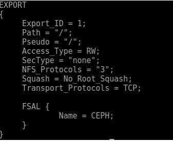

4. 通过提供Ganesha.conf 启动NFS Ganesha守护进程
```
ganesha.nfsd -f /etc/ganesha.conf -L /var/log/ganesha.log -N NIV_DEBUG
showmount -e
```

5. 客户端挂载
```
yum install -y nfs-utils
mkdir /mnt/cephnfs
mount -o rw,noatime node2:/ /mnt/cephnfs
```