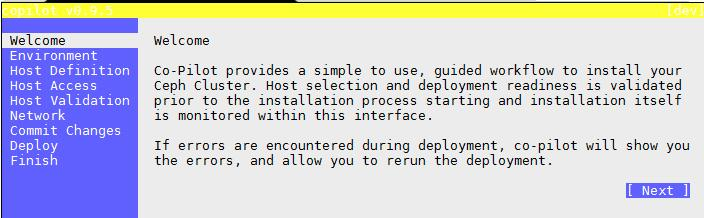
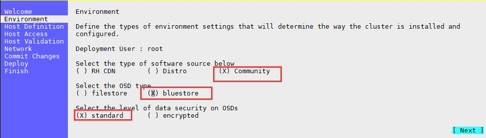
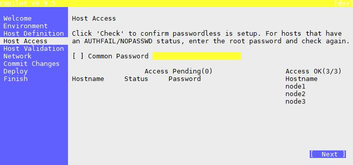
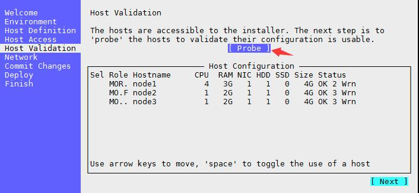
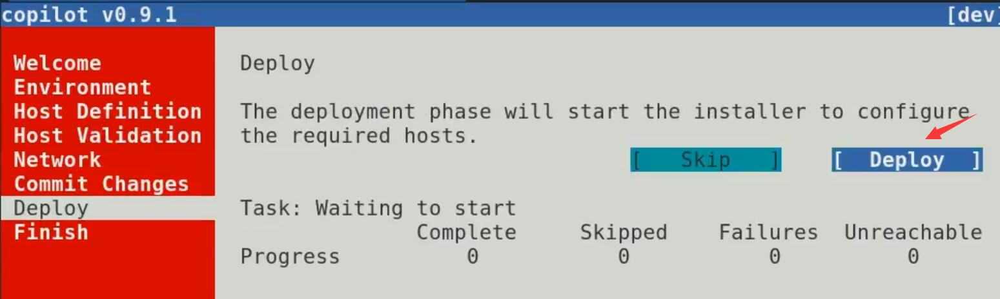
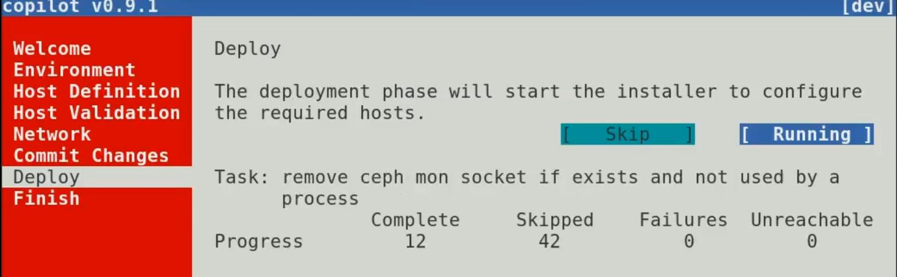

<!-- TOC -->

- [基于ceph-ansible搭建ceph集群](#基于ceph-ansible搭建ceph集群)
    - [一、环境准备](#一环境准备)
    - [二、说明](#二说明)
    - [三、安装前系统环境配置](#三安装前系统环境配置)
        - [四、升级内核](#四升级内核)
        - [五、安装ceph集群](#五安装ceph集群)
            - [5.1 下载项目](#51-下载项目)
            - [5.2 配置ansible](#52-配置ansible)
            - [5.3 配置ceph-ansible](#53-配置ceph-ansible)
            - [5.4 开始安装](#54-开始安装)
        - [六、基于ceph-ansible的ceph-ansible-copilot可视化安装ceph集群](#六基于ceph-ansible的ceph-ansible-copilot可视化安装ceph集群)
            - [6.1 从下载ceph-ansible源文件](#61-从下载ceph-ansible源文件)
            - [6.2 copilot可视化配置安装](#62-copilot可视化配置安装)
            - [6.3 注意](#63-注意)
            - [6.4 本人安装资源](#64-本人安装资源)
            - [6.5 参考文档](#65-参考文档)

<!-- /TOC -->
# 基于ceph-ansible搭建ceph集群
ceph-ansible 是ceph官方提供的对ceph进行自动化的安装的工具
## 一、环境准备
|IP|	主机名|	节点|	系统|
|---|---|---|---|
|192.168.38.15|node1|	ceph-ansible、mon、mgr、osd、rgw、mds|Centos7.6.1810|
|192.168.38.16|node2|	mon、mgr、osd、rgw、mds|	Centos7.6.1810|
|192.168.38.17|node3|	mon、mgr、osd、rgw、mds|	Centos7.6.1810|

- 每个虚拟机分别再挂载一块磁盘：/dev/sd(3G)

## 二、说明
1. 这里直接使用root用户部署
2. 若无特别提醒，都在 192.168.38.15 机器上操作
## 三、安装前系统环境配置
- 请参考：<a href="./ceph组件介绍及基于ceph-deploy部署.md">ceph组件介绍及基于ceph-deploy部署3.1--3.11</a>
- 配置源
- 免密登陆
- 时间同步
> 以上都是必须配置

- /etc/hosts 配置
### 四、升级内核

> 建议系统内核升级到4.x，不然容易出各种问题，不要给自己找不必要的麻烦。
```
# 载入公钥
rpm --import https://www.elrepo.org/RPM-GPG-KEY-elrepo.org
# 安装ELRepo
rpm -Uvh http://www.elrepo.org/elrepo-release-7.0-3.el7.elrepo.noarch.rpm
# 载入elrepo-kernel元数据
yum --disablerepo=\* --enablerepo=elrepo-kernel repolist
# 查看可用的rpm包
yum --disablerepo=\* --enablerepo=elrepo-kernel list kernel*
# 安装最新版本的kernel
yum --disablerepo=\* --enablerepo=elrepo-kernel install -y kernel-ml.x86_64

#查看默认启动顺序
awk -F\' '$1=="menuentry " {print $2}' /etc/grub2.cfg
CentOS Linux (4.17.1-1.el7.elrepo.x86_64) 7 (Core)
CentOS Linux (3.10.0-862.3.3.el7.x86_64) 7 (Core)
CentOS Linux (3.10.0-862.el7.x86_64) 7 (Core)
CentOS Linux (0-rescue-14cd5fb0ee114fa88d6c747daee61c31) 7 (Core)

#默认启动的顺序是从0开始，新内核是从头插入（目前位置在0，而4.4.4的是在1），所以需要选择0。
grub2-set-default 0
reboot
uname -a
# 删除老内核以及内核工具
rpm -qa|grep kernel|grep 3.10
rpm -qa|grep kernel|grep 3.10|xargs yum remove -y

# 安装新版本工具包
yum --disablerepo=\* --enablerepo=elrepo-kernel install -y kernel-ml-tools.x86_64

rpm -qa|grep kernel
```
> 内核版本这里选的的ml，如果求稳妥可以选择lt版本。

### 五、安装ceph集群
#### 5.1 下载项目
```
cd /usr/share/
git clone https://github.com/ceph/ceph-ansible.git
cd ceph-ansible
git checkout stable-3.1
```
#### 5.2 配置ansible
> vim /usr/share/ceph-ansible/hosts
```
[mons]
node1
node2
node3

[mgrs]
node1
node2
node3

[osds]
node1
node2
node3

[rgws]
node1
node2
node3

[mdss]
node1
node2
node3
```
#### 5.3 配置ceph-ansible
```
cp site.yml.sample site.yml
cp group_vars/all.yml.sample all.yml
cp group_vars/mdss.yml.sample mdss.yml
cp group_vars/mgrs.yml.sample mgrs.yml
cp group_vars/mgrs.yml.sample mgrs.yml
cp group_vars/mons.yml.sample mons.yml
cp group_vars/osds.yml.sample osds.yml
cp group_vars/rgws.yml.sample rgws.yml
```
1. group_vars/site.yml
```
---
# created by copilot - only overrides from defaults shown Thu Jul 18 22:26:48 2019

fetch_directory: ~/ceph-ansible-keys
cluster: ceph

ceph_origin: repository
ceph_repository: community
ceph_stable_release: luminous

osd_objectstore: bluestore

monitor_interface: eth0
public_network: 192.168.38.0/24
cluster_network: 192.168.38.0/24

# General ceph options
generate_fsid: true
cephx: true

# radosgw options
radosgw_dns_name:
radosgw_interface: eth0

ceph_conf_overrides:
    global:
      rbd_default_features: 7
      auth cluster required: cephx
      auth service required: cephx
      auth client required: cephx
      osd journal size: 2048
      osd pool default size: 3
      osd pool default min size: 1
      mon_pg_warn_max_per_osd: 1024
      osd pool default pg num: 128
      osd pool default pgp num: 128
      max open files: 131072
      osd_deep_scrub_randomize_ratio: 0.01

    mgr:
      mgr modules: dashboard

    mon:
      mon_allow_pool_delete: true

    client:
      rbd_cache: true
      rbd_cache_size: 335544320
      rbd_cache_max_dirty: 134217728
      rbd_cache_max_dirty_age: 10

    osd:
      osd mkfs type: xfs
    # osd mount options xfs: "rw,noexec,nodev,noatime,nodiratime,nobarrier"
      ms_bind_port_max: 7100
      osd_client_message_size_cap: 2147483648
      osd_crush_update_on_start: true
      osd_deep_scrub_stride: 131072
      osd_disk_threads: 4
      osd_map_cache_bl_size: 128
      osd_max_object_name_len: 256
      osd_max_object_namespace_len: 64
      osd_max_write_size: 1024
      osd_op_threads: 8

      osd_recovery_op_priority: 1
      osd_recovery_max_active: 1
      osd_recovery_max_single_start: 1
      osd_recovery_max_chunk: 1048576
      osd_recovery_threads: 1
      osd_max_backfills: 4
      osd_scrub_begin_hour: 23
      osd_scrub_end_hour: 7
      
     # bluestore block create: true
     # bluestore block db size: 73014444032
     # bluestore block db create: true
     # bluestore block wal size: 107374182400
     # bluestore block wal create: true
```
2. group_vars/mons.yml
- 如果不适用Ceph 文件存储，也可以不要下面配置，默认即可
```
---
# created by copilot - only overrides from defaults shown Thu Jul 18 22:26:48 2019

mon_group_name: mons
cephfs: cephfs
cephfs_data: cephfs_data
cephfs_metadata: cephfs_metadata
cephfs_pools:
  - { name: "{{ cephfs_data }}", pgs: 256 }
  - { name: "{{ cephfs_metadata }}", pgs: 256 }

```
3. group_vars/osds.yml
```
---
# created by copilot - only overrides from defaults shown Thu Jul 18 22:26:48 2019

osd_objectstore: bluestore
osd_scenario: collocated
dmcrypt: false

# devices common to all osd hosts
devices:
  - /dev/sdb
```
4. site.yml
```
- hosts:
  - mons
#  - agents
  - osds
  - mdss
  - rgws
#  - nfss
#  - restapis
#  - rbdmirrors
#  - clients
  - mgrs
#  - iscsigws
#  - iscsi-gws # for backward compatibility only!
```

5. group_vars/mdss.yml|mgrs.yml|rgws.yml

- 暂时不做操作，如需配置请自己查找对应参数,此处默认参数

#### 5.4 开始安装
1. 客户端卸载pip中安装的urllib3，不然会失败
```
pip freeze|grep urllib3
pip uninstall urllib3
```
2. 执行安装命令
```
ansible-playbook -i hosts site.yml
```
> 至此ceph部署完成，登陆ceph节点检查状态。

3. 安装后检查
- 当执行完成后，通过
```
ceph -s
```
- 可以看到集群已经ok，所有osd也已经up/in
- 由于我们配置里设置了：osd_crush_update_on_start = False
- 所以当我们创建pool的时候集群状态会提示：
```
cluster:
    id:     efeda920-833a-492d-85d7-9b409b86a079
    health: HEALTH_WARN
            Reduced data availability: 128 pgs inactive
            too few PGs per OSD (21 < min 30)
 ...
 
  data:
    pools:   1 pools, 128 pgs
    objects: 0 objects, 0 bytes
    usage:   6170 MB used, 2993 GB / 2999 GB avail
    pgs:     100.000% pgs unknown
             128 unknown
```

### 六、基于ceph-ansible的ceph-ansible-copilot可视化安装ceph集群
- ceph-ansible-copilot提供一个UI界面，通过UI界面生成上面的yml文件，可视化操作命令执行ansible-playbook site.yml来部署ceph集群。
- 缺点是：
  - 只能生成MON、OSD、RGW、MDS相关的4个yml配置
  - 并且配置只是初始化集群的默认参数，比如OSD的线程数等参数需要修改还需要手动添加配置
> 本人使用ceph-ansible-copilot安装时，由于可视化界面生成的osds.yml回多挂载一个已经使用的盘，导致失败，手动删除该文件中的关于盘的配置，即可安装。
#### 6.1 从下载ceph-ansible源文件
1. clone源文件到/usr/share/
```
cd /usr/share/
git clone https://github.com/ceph/ceph-ansible.git
```
2. 切换分支
- 目前copilot支持ansible-2.4.x (tested against 2.4.1 and 2.4.2),所以选择ceph-ansible的stable-3.1分支
```
git checkout stable-3.1
```
3. 通过requirements.txt安装Ansible和一些 Python libraries
```
yum install -y python-urwid
pip install -r requirements.txt
```
3. 使用root账户安装copilot(0.9.5)
```
 cd ~
git clone https://github.com/pcuzner/ceph-ansible-copilot.git
cd ceph-ansible-copilot
python setup.py install --record install_copilot_log.txt
```
4. 运行copilot
```
cd /usr/share/ceph-ansible
copilot
```
> 需要配置免密登陆，请参考ceph-deploy安装文档
#### 6.2 copilot可视化配置安装
1. welcome

2. Environment

2. Host Definition

3. Host Access

4. Hosts Validation

5. Network
- 设置集群内网，和客户端访问的外网，此处内外网统一

6. Commit Change

7. Deploy


8. Finish 

#### 6.3 注意
1. 如果安装失败可以通过下面代码安装查看错误
```
ansible-playbook site.yml -i hosts -vvv
```
  - 通过查看报错日志，解决相关问题，继续执行上面命令
2. 如果copilt安装成功或失败后都可以修改yml配置参数，重新执行ansible-playbook site.yml 继续安装，并且集群的配置也会根据配置参数的变化而变化
#### 6.4 本人安装资源
1. ceph-ansible
- 该资源已经进行相关配置，下载后可以选择性修改yml配置后，执行
```
su root
cd ceph-ansible/
pip install -r tests/requirements.txt
ansible-playbook site.yml -i hosts
```
<a href="./img/ceph-ansible.zip">ceph-ansible download</a>

2. ceph-ansible-copilot

<a href="./img/ceph-ansible-copilot.zip">ceph-ansible-copilot download</a>

#### 6.5 参考文档
http://opensource-storage.blogspot.com/2017/12/want-to-install-ceph-but-afraid-of.html